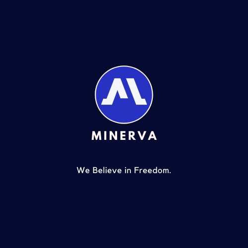

# Minerva
> A platform for sharing selfmade courses, quizes to other in the platform

## Table of Contents
* [Information](#general-info)
* [Screenshots](#screenshots)
* [Technologies](#technologies)
* [Setup](#setup)
* [Status](#status)
* [Inpsiration](#inspiration)
* [Contact](#contact)

## Information
Minerva is an open source platform for people to learn valuable skills. It is a platform dedicated to anyone with a will to learn. We, the creators of Minerva, beleive that education is a basic right and everyone needs to have access to it. Hence why, we have developed this platform for those who want to enhance their learning experience.

## Screenshots


## Technologies
For backend, Minerva runs on Python's Django framework. It is built with HTML, CSS and JS with jinja templating engine for frontend. It is fast precise and functional with beautiful UI.

## Setup

### How to Run ?

### From python on host machine
To run this app from python on the host machine run the following commands

#### For Windows
```
python -m pip install -r requirements.txt
python manage.py runserver
```
#### For Linux/Mac
```
python3 -m pip install -r requirements.txt
python3 manage.py runserver
```

### Using virtualenv

#### For Windows
```
./venv/Scripts/activate
python manage.py runserver
```
#### For Linux
```
source venv/bin/activate
python3 manage.py runserver
```

#### Using Docker
 ```
 docker-compose up -d
 ```
## Status
Project is : _In Development_


## Inspiration
Lorem ipsum dolor sit amet, consectetur adipisicing elit, sed do eiusmod
tempor incididunt ut labore et dolore magna aliqua. Ut enim ad minim veniam,
quis nostrud exercitation ullamco laboris nisi ut aliquip ex ea commodo
consequat. Duis aute irure dolor in reprehenderit in voluptate velit esse
cillum dolore eu fugiat nulla pariatur. Excepteur sint occaecat cupidatat non
proident, sunt in culpa qui officia deserunt mollit anim id est laborum.

## Contact 
You can contact us at [contact@apurbaadhikari.com.np](contact@apurbaadhikari.com.np)